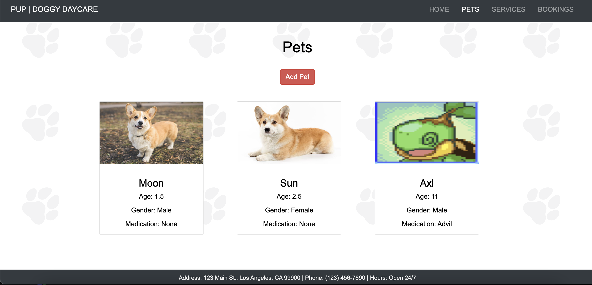
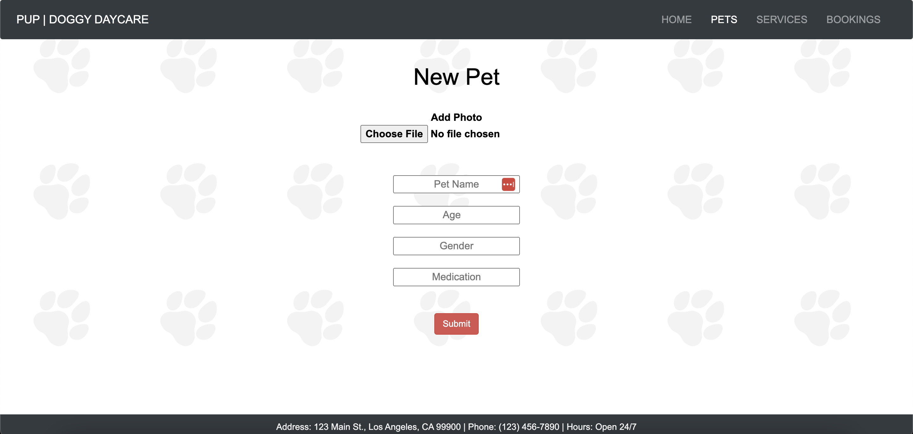
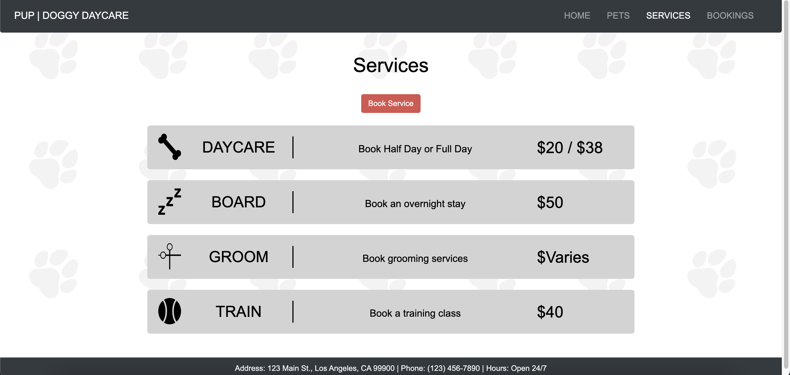
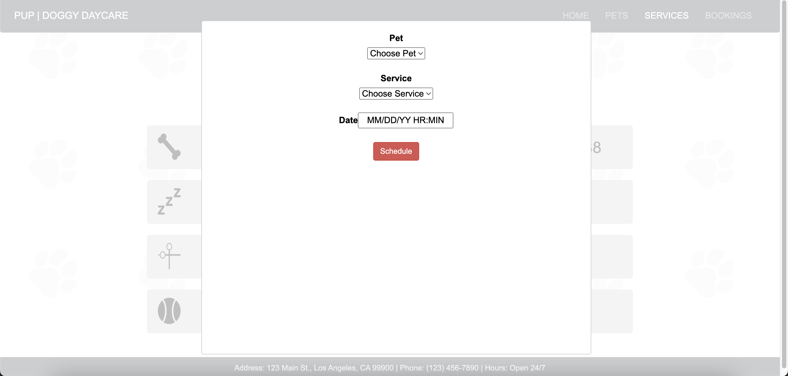
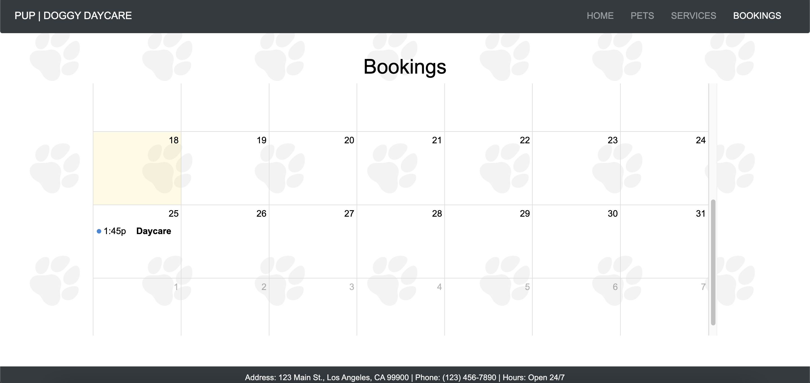

<!-- TABLE OF CONTENTS -->

  
Table of Contents

  <ol>
    <li><a href="#description">Description</a></li>
    <li><a href="#link-to-the-app">Link to App</a></li>
    <li><a href="#user-story">User Story</a></li>
    <li><a href="#future-development">Future Development</a></li>
    <li><a href="#collaborators">Collaborators</a></li>
  </ol>

# Doggy Daycare

## Description

A pet service scheduling application where users can schedule daycare, board, grooming, and training services for their pet.

* After creating an account, the user is logged in and can add their pet's information along with an image. 
* Once they've added their pet, they may choose one of four pet services with the date of the service. After scheduling, all services will appear on the 'Bookings' page. 
* This application uses the MERN stack. MongoDB acts as our database, Express is a Node.js framework that helps manage servers and routes, and React is a front-end library that creates the app's user interface.

## Link to App

* [Doggy Daycare Deployed Heroku App](https://lit-everglades-07230.herokuapp.com/)

(<a href="#top">back to top</a>)

## User Story

**Launch**

* WHEN I launch the application 

* THEN I will be directed to the home page with a button to log in.

* WHEN I click Log in

* THEN I will prompted to enter my credentials or register a new account.

**Registration**
* WHEN I click register

* THEN I will be presented with a form to enter an email address and password.

* WHEN I submit the form

* THEN I will be logged in and redirected to the home page.

**Login**

* WHEN I click login 

* THEN I there are fields to enter my email and password.

* WHEN I submit my login information

* THEN my credentials are checked. If invalid credentials, the application returns an error message.

* WHEN I am logged in 

* THEN I am on the homepage with navigation tabs.

**Navigation**

* WHEN I view the navigation tabs 

* THEN I see a section for "Home", "Pets", "Bookings" and "Services".

**Pets**

* WHEN I click on "Pets" 

* THEN I see an option to “Add Pet”.

* WHEN I click the “Add Pet” button

* THEN I see a form to add information about my pet (name / medication / photo / etc.).

* WHEN I submit my pet’s information

* THEN I see a card generated with my pet’s photo and name.

* WHEN I select the card

* THEN I will be able to see my pet’s information.

**Service**

* WHEN I click on the Service nav tab

* THEN I see a list of services and prices.

* WHEN I click "Add Service"

* THEN I can select one of my pets, the desired service, and the date and time for the service.

* WHEN I submit my choice

* THEN I see the reservation added to the calendar.

**Bookings**

* WHEN I click on "Bookings"

* THEN I see a calendar with the current bookings.

## Adding a Pet

## Scheduling a Service

## See Bookings

(<a href="#top">back to top</a>)

## Future Development

* Add cart and Stripe functionality to process payments

* Add to Pets section

* Functionality to edit / remove pets

* More fields to keep track of vaccination records, birthdays, etc.

* Implement an API/cloud server that stores images to be used in the application (we currently convert images into base64 then pass the 
string to MongoDB which isn’t very efficient)

* Adding service - Intuitive date and time selector vs input fields(Datetime vs. fullCalendar time)

* Central profile page for the user that allows them to add/edit any part of their profile (whether that be pets, services, etc)

* Communication functionality (ie. ability to chat with other users if there are questions about services)

* Reviews page for users that perform services to pets

## Collaborators
[Alan Huang](https://github.com/ahuang23)

[Anhvu Nguyen](https://github.com/IamIncognito123)

[Jeffrey Sun](https://github.com/jffsun)

[Markus Mercado](https://github.com/markkoos)

## Presentation

You can view the Google Slides presentation for our application below:
* [Google Slides](https://docs.google.com/presentation/d/10zNjL1TkRq0khWF7hR4A9t8Ch_vfp-Jl8D8cHg7860g/edit?usp=sharing)

(<a href="#top">back to top</a>)

